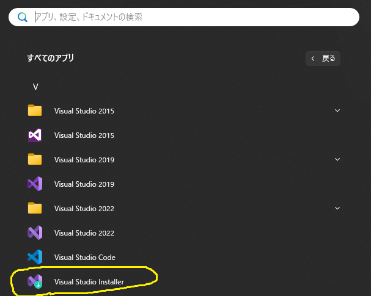
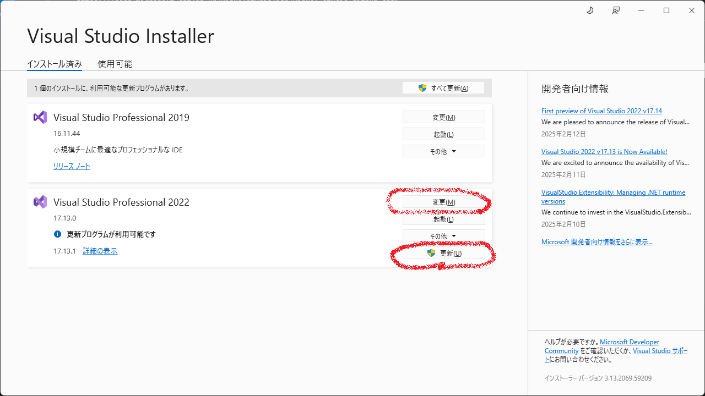
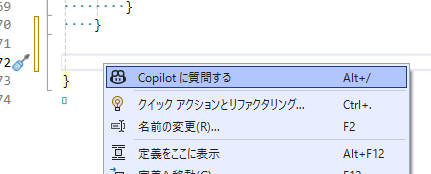
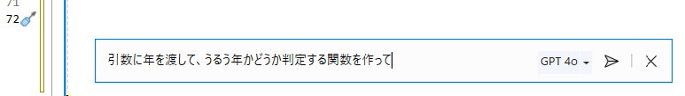
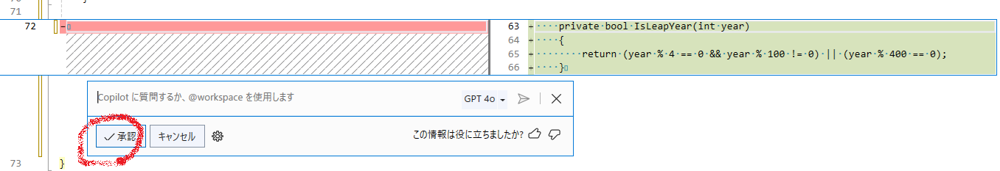
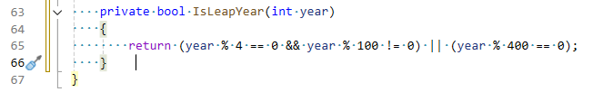

# Visual Studio2022にCopilotを入れてみた

1. 下記リンクに沿って行えば導入はできますが、下記に画像を残しました 

[https://learn.microsoft.com/en-us/visualstudio/ide/visual-studio-github-copilot-install-and-states?view=vs-2022#install-using-the-visual-studio-installer](https://learn.microsoft.com/en-us/visualstudio/ide/visual-studio-github-copilot-install-and-states?view=vs-2022#install-using-the-visual-studio-installer)

2. Installerを起動します 
 

1. 更新を押して最新にします 
   変更を押します 
 

1. Github CopilotをONにします 
   (例はASP.NETとWeb開発) 
   変更を押します 
 

1. Githubアカウントが必要なので登録します（割愛） 

[https://github.com/](https://github.com/)

3. GithubにログインしてStart free trialボタンを押します 
 
   
1. Visual Studioを起動します 
   右上のGithub Copilotボタンを押します 
 
   ログインします（どれを押したか覚えてないです。。。） 
  
  ヘルプ－Visual Studioの登録を押すと（ただの確認なので押さなくていい）アカウントが２つ入っていました 
  (なんか視覚情報を更新してと出てますが。。。) 
  

1. 使ってみます 
   * 右クリックで質問するを選択します 
 
   * 質問を入力します 
 
   * 右側にコードが出てきました 
   * 承認を押します 
 
   * 左側にコードが入りました 
 

   複雑なコードもレスポンスよく実行できるのか気になるところです 

1. 制限事項 
   残念ながら使用制限があります、１か月持つならありですかね。。。 

[https://docs.github.com/ja/copilot/managing-copilot/managing-copilot-as-an-individual-subscriber/about-github-copilot-free](https://docs.github.com/ja/copilot/managing-copilot/managing-copilot-as-an-individual-subscriber/about-github-copilot-free)

 

1. 入力候補がじゃまくさいと感じる時は入力候補を有効にするをOFFにします。。。 
   その下のオプションで色々変えれるようです 

 
 1. セキュリティ 
    会社のソースコードとなるとセキュリティが気になるかと思います 
    下記に調べた方がいらっしゃいました 
    https://zenn.dev/miyajan/scraps/3567cee380280c 
    取り合えず、githubのサイトの下記がデフォルトONなのでOFFにします 
    そうすると自分のコードが GitHub Copilot の改善に使われることはないらしい 
     
    「そもそもコードサジェストのために情報を送信する必要がある」とも書いてあります

